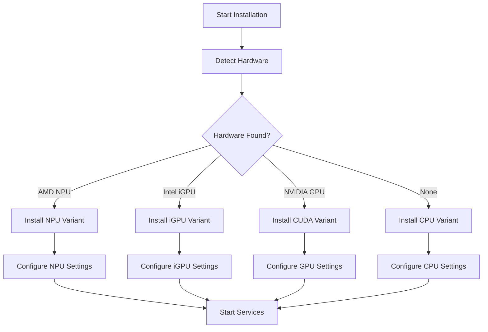

# 🦄 Unicorn Orator Hardware Integration Plan

## Overview
This document outlines the systematic integration of hardware-specific implementations for WhisperX (STT) and Kokoro (TTS) to support multiple acceleration platforms.

## 🎯 Goals
1. Support multiple hardware accelerators without user complexity
2. Automatic detection and optimal configuration
3. Manual override options for power users
4. Maintain single API interface regardless of backend
5. Preserve backward compatibility

## 🔧 Hardware Support Matrix

### Speech-to-Text (WhisperX)
| Hardware | Implementation | Diarization | Source | Priority |
|----------|---------------|-------------|---------|----------|
| CPU | whisperx-cpu | ✅ Yes | Existing | ✅ Done |
| NVIDIA GPU | whisperx-cuda | ✅ Yes | Existing | ✅ Done |
| AMD NPU (XDNA1) | whisperx-npu | ✅ Yes | UC-Meeting-Ops | 🔴 High |
| AMD NPU (XDNA1) | whisperx-npu-lite | ❌ No | UC-Meeting-Ops | 🔴 High |
| Intel iGPU | whisperx-igpu | ✅ Yes | To Create | 🟡 Medium |
| Intel iGPU | whisperx-igpu-lite | ❌ No | To Create | 🟡 Medium |

### Text-to-Speech (Kokoro)
| Hardware | Implementation | Source | Priority |
|----------|---------------|---------|----------|
| CPU | kokoro-cpu | Existing | ✅ Done |
| NVIDIA GPU | kokoro-cuda | Existing | ✅ Done |
| Intel iGPU | kokoro-igpu | Existing | ✅ Done |
| AMD NPU (XDNA1) | kokoro-npu | magic-unicorn-tts | 🔴 High |

## 📁 Proposed Directory Structure

```
Unicorn-Orator/
├── whisperx/
│   ├── cpu/              # Default CPU implementation
│   ├── cuda/             # NVIDIA GPU implementation
│   ├── npu/              # AMD NPU implementation (with diarization)
│   ├── npu-lite/         # AMD NPU implementation (without diarization)
│   ├── igpu/             # Intel iGPU implementation (with diarization)
│   ├── igpu-lite/        # Intel iGPU implementation (without diarization)
│   └── base/             # Shared base code
├── kokoro-tts/
│   ├── cpu/              # CPU implementation
│   ├── cuda/             # NVIDIA GPU implementation
│   ├── igpu/             # Intel iGPU implementation (OpenVINO)
│   ├── npu/              # AMD NPU implementation
│   └── base/             # Shared base code
├── hardware-detect/      # Hardware detection utilities
│   ├── detect.py         # Main detection script
│   ├── amd_npu.py        # AMD NPU detection
│   ├── intel_gpu.py      # Intel GPU detection
│   └── nvidia_gpu.py     # NVIDIA GPU detection
└── docker-compose/       # Hardware-specific compose files
    ├── docker-compose.cpu.yml
    ├── docker-compose.cuda.yml
    ├── docker-compose.npu.yml
    └── docker-compose.igpu.yml
```

## 🔍 Hardware Detection Strategy

### Phase 1: Detection Script
Create a comprehensive hardware detection script that identifies:
- CPU capabilities (AVX, AVX2, etc.)
- NVIDIA GPUs (via nvidia-smi)
- AMD NPUs (via rocm-smi or custom detection)
- Intel iGPUs (via intel_gpu_top or vainfo)

### Phase 2: Priority System
1. AMD NPU (if available and AMD system)
2. Intel iGPU (if available and Intel system)
3. NVIDIA GPU (if available)
4. CPU (fallback)

### Detection Implementation
```python
class HardwareDetector:
    def detect_amd_npu(self):
        # Check for XDNA driver
        # Check for Ryzen AI Software
        # Verify NPU availability
        
    def detect_intel_igpu(self):
        # Check for Intel graphics
        # Verify OpenVINO compatibility
        # Check compute capability
        
    def detect_nvidia_gpu(self):
        # Use nvidia-smi
        # Check CUDA compatibility
        # Get VRAM amount
        
    def recommend_configuration(self):
        # Return optimal configuration based on detected hardware
```

## 🚀 Implementation Phases

### Phase 1: Foundation (Week 1)
- [x] Create project structure
- [ ] Implement hardware detection system
- [ ] Create modular docker-compose system
- [ ] Update installer with detection logic

### Phase 2: AMD NPU Integration (Week 2)
- [ ] Port WhisperX NPU implementation from UC-Meeting-Ops
- [ ] Port WhisperX NPU-lite (no diarization) 
- [ ] Port Kokoro NPU from magic-unicorn-tts
- [ ] Create AMD-specific Docker images
- [ ] Test on AMD hardware

### Phase 3: Intel iGPU WhisperX (Week 3)
- [ ] Create WhisperX iGPU implementation using OpenVINO
- [ ] Create lite version without diarization
- [ ] Optimize for Intel Arc and Iris Xe
- [ ] Create Intel-specific Docker images
- [ ] Test on Intel hardware

### Phase 4: Unified Installer (Week 4)
- [ ] Create interactive installer with hardware detection
- [ ] Add manual override options
- [ ] Implement configuration persistence
- [ ] Add hardware switching capability
- [ ] Create upgrade path

### Phase 5: Testing & Documentation (Week 5)
- [ ] Test on various hardware configurations
- [ ] Create performance benchmarks
- [ ] Update documentation
- [ ] Create troubleshooting guide
- [ ] Release v2.0

## 🔧 Configuration System

### Environment Variables
```bash
# Hardware Selection (auto, cpu, cuda, npu, igpu)
WHISPERX_BACKEND=auto
KOKORO_BACKEND=auto

# Feature Flags
WHISPERX_ENABLE_DIARIZATION=true
WHISPERX_USE_LITE_MODEL=false

# Hardware-Specific Options
AMD_NPU_DEVICE=/dev/npu0
INTEL_GPU_DEVICE=/dev/dri/renderD128
CUDA_VISIBLE_DEVICES=0

# Performance Tuning
NPU_BATCH_SIZE=8
IGPU_BATCH_SIZE=4
```

### Configuration File (.orator.yml)
```yaml
hardware:
  detection: auto  # auto, manual
  whisperx:
    backend: auto  # auto, cpu, cuda, npu, igpu
    variant: full  # full, lite (no diarization)
  kokoro:
    backend: auto  # auto, cpu, cuda, npu, igpu

preferences:
  prefer_npu: true  # Prefer NPU over GPU when both available
  fallback_to_cpu: true  # Fall back to CPU if preferred hardware fails

performance:
  batch_size: auto
  compute_precision: auto  # int8, fp16, fp32
```

## 📊 Performance Targets

### WhisperX Performance Goals
| Hardware | Target Speed | Memory Usage |
|----------|--------------|--------------|
| AMD NPU | 5x realtime | < 2GB |
| Intel iGPU | 4x realtime | < 3GB |
| NVIDIA GPU | 10x realtime | < 4GB |
| CPU | 2x realtime | < 4GB |

### Kokoro TTS Performance Goals
| Hardware | Target Speed | Latency |
|----------|--------------|---------|
| AMD NPU | 3x realtime | < 500ms |
| Intel iGPU | 3x realtime | < 500ms |
| NVIDIA GPU | 5x realtime | < 300ms |
| CPU | 1x realtime | < 1000ms |

## 🛠️ Installation Flow



## 📝 User Experience

### Interactive Installer
```bash
./install.sh

🦄 Unicorn Orator Hardware Detection
=====================================
Detecting available hardware...

✅ Found: AMD Ryzen 7 7840HS with XDNA NPU (16 TOPS)
✅ Found: AMD Radeon 780M iGPU
❌ Not Found: NVIDIA GPU

Recommended Configuration:
- WhisperX: AMD NPU (5x faster than CPU)
- Kokoro TTS: AMD NPU (3x faster than CPU)

Use recommended configuration? (Y/n): Y

Options:
1. Enable speaker diarization? (Y/n): Y
2. Prefer NPU over iGPU? (Y/n): Y
3. Fall back to CPU if NPU fails? (Y/n): Y

Installing Unicorn Orator with AMD NPU support...
```

### Manual Override
```bash
./install.sh --whisperx-backend=igpu --kokoro-backend=npu
```

## 🔄 Migration Path

For existing users:
1. Detect current installation
2. Backup configuration
3. Offer hardware-optimized upgrade
4. Migrate settings
5. Verify functionality

## 📚 Documentation Updates

### README Sections to Add:
- Hardware Requirements
- Supported Accelerators
- Performance Comparison
- Installation per Hardware
- Troubleshooting by Platform

### New Documents:
- HARDWARE_SUPPORT.md
- PERFORMANCE_GUIDE.md
- NPU_SETUP.md
- IGPU_SETUP.md

## 🎯 Success Metrics

1. **Compatibility**: Works on 90% of modern AMD/Intel systems
2. **Performance**: 3-5x improvement over CPU baseline
3. **Ease of Use**: Single command installation
4. **Reliability**: Automatic fallback on errors
5. **Maintainability**: Modular architecture for easy updates

## 📅 Timeline

- **Week 1**: Foundation and detection system
- **Week 2**: AMD NPU integration
- **Week 3**: Intel iGPU WhisperX creation
- **Week 4**: Unified installer
- **Week 5**: Testing and documentation
- **Release**: Unicorn Orator v2.0 with Universal Hardware Support

## 🚦 Next Steps

1. Clone UC-Meeting-Ops and analyze NPU implementations
2. Clone magic-unicorn-tts for AMD NPU Kokoro
3. Set up test environments for each hardware type
4. Begin Phase 1 implementation
5. Create hardware detection prototype

---

This plan ensures Unicorn Orator becomes the most hardware-compatible speech processing platform available, automatically leveraging whatever acceleration is available while maintaining simplicity for users.